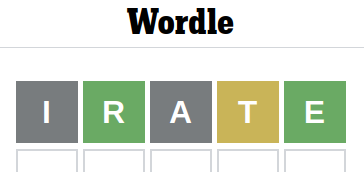

# wordle-solver
**a bot for playing the game wordle**

# interacting with the solver

to build the program:
```
$ make
```

the solver can be called in one of two different ways:
```
$ ./solver motif
```

this runs the guessing algorithm with a specified secret word, automatically.

or alternatively, to play a wordle puzzle with an unknown word (ie, live on a website):

```
$ ./solver
```

this will suggest guesses for the user, and prompt them to input the result as a string of 5 characters (some sequence of 'g' 'y' and 'x'), making more suggestions as it narrows the search space.

# example


Here we guessed "irate", and the wordle game gave back: gray, green, gray, yellow, green. We represent this in our program as "xgxyg".


